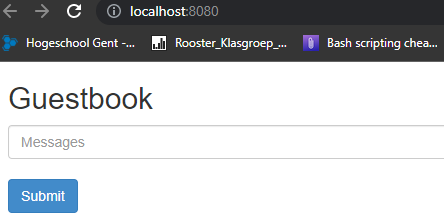

# Lab 4: Container orchestration with Kubernetes

## 4.1. Set up the lab environment

Minikube en kubectl installeren verliep vlot, hier was er geen enkel probleem mee.
Ook het opstarten, na wat geduld te hebben, ging goed en het dashboard opende ook zoals gehoopt.
Ik heb besloten om de extra nodes niet toe te voegen, omdat ik dacht dat het labo op zichzelf al voldoende werk zal vragen.

## 4.2. Basic operation

### 4.2.1. Hello world!

De instructies op de kubernetes-website waren zeer duidelijk, maar toen ik de app opende met `minikube service hello-node` kreeg ik geen verbinding met de container. 

De error had te maken met een fout in een commando op de website, dacht ik. Ik heb dan de service en deployment verwijderd, en met een aangepast commando opnieuw geprobeerd. Nu keek ik in het dashboard, en zag ik dat de deployment groen was, dus dacht ik dat dit wel ging werken. Maar helaas, ik kreeg nu een gelijkaardige error, maar als message stond er `ERR_CONNECTION_REFUSED`

Na wat zoeken heb ik het gevraagd aan een klasgenoot, en omdat het bij hem ook niet werkte (en het uiteindelijk toch een tutorial is voor de rest van het labo) heb ik tactisch besloten om het links te laten liggen.

### 4.2.2. Working with manifest files

Het runnen van de aparte manifest files lukte perfect, en na `minikube service echo-service` uit te voeren kreeg ik een webpagina met volgende uitvoer
```
CLIENT VALUES:
client_address=172.17.0.1
command=GET
real path=/
query=nil
request_version=1.1
request_uri=http://192.168.59.100:8080/

SERVER VALUES:
server_version=nginx: 1.10.0 - lua: 10001

HEADERS RECEIVED:
accept=text/html,application/xhtml+xml,application/xml;q=0.9,image/avif,image/webp,image/apng,*/*;q=0.8,application/signed-exchange;v=b3;q=0.9
accept-encoding=gzip, deflate
accept-language=en-US,en;q=0.9,nl;q=0.8
connection=keep-alive
host=192.168.59.100:30602
upgrade-insecure-requests=1
user-agent=Mozilla/5.0 (Windows NT 10.0; Win64; x64) AppleWebKit/537.36 (KHTML, like Gecko) Chrome/108.0.0.0 Safari/537.36
BODY:
-no body in request-
```

Na het runnen van `kubectl apply -f echo-all.yml` kreeg ik exact dezelfde uitvoer

```console
CLIENT VALUES:
client_address=172.17.0.1
command=GET
real path=/
query=nil
request_version=1.1
request_uri=http://192.168.59.100:8080/

SERVER VALUES:
server_version=nginx: 1.10.0 - lua: 10001

HEADERS RECEIVED:
accept=text/html,application/xhtml+xml,application/xml;q=0.9,image/avif,image/webp,image/apng,*/*;q=0.8,application/signed-exchange;v=b3;q=0.9
accept-encoding=gzip, deflate
accept-language=en-US,en;q=0.9,nl;q=0.8
connection=keep-alive
host=192.168.59.100:30302
upgrade-insecure-requests=1
user-agent=Mozilla/5.0 (Windows NT 10.0; Win64; x64) AppleWebKit/537.36 (KHTML, like Gecko) Chrome/108.0.0.0 Safari/537.36
BODY:
-no body in request-
```

Het aantal replicas was simpel om te veranderen, maar om de juiste commandos te vinden voor o.a. de nodes te tonen waarop de pod runt, was opzoekwerk nodig. Omdat ik geen extra nodes toegevoegd had, was er slechts 1 mogelijk node-adres voor de service.

## 4.3. Labels and selectors

Om de labels te lezen met bijvoorbeeld `kubect get pods` was zeer vanzelfsprekend, dus hier had ik geen problemen mee

### 4.3.1. Manipulating labels manually
De labels veranderen was ook vrij vanzelfsprekend, zoals duidelijk te zien is de volgende output.
```console
4.2> kubectl get pods --show-labels
NAME                                  READY   STATUS    RESTARTS      AGE   LABELS
echo-all-deployment-846b446fc-gvktb   1/1     Running   1 (19h ago)   21h   app=echoserver,application_type=demo,pod-template-hash=846b446fc
echo-all-deployment-846b446fc-np42v   1/1     Running   1 (19h ago)   21h   app=echoserver,application_type=demo,pod-template-hash=846b446fc
echo-all-deployment-846b446fc-qhhfk   1/1     Running   1 (19h ago)   21h   app=echoserver,application_type=demo,pod-template-hash=846b446fc
echo-deployment-846b446fc-6rxgd       1/1     Running   1 (19h ago)   21h   app=echoserver,pod-template-hash=846b446fc
```
Ook het overschrijven van een label was redelijk simpel, aangezien het duidelijk uitgelegd werd wat er gedaan moest worden. De error message was als volgt:
```console
4.2> kubectl label pods echo-all-deployment-846b446fc-qhhfk application_type=app
error: 'application_type' already has a value (demo), and --overwrite is false
```
Na het toevoegen van `--overwrite` was het label uiteindelijk wel aangepast

```console
4.2> kubectl get pods --show-labels
NAME                                  READY   STATUS    RESTARTS      AGE   LABELS
echo-all-deployment-846b446fc-gvktb   1/1     Running   1 (19h ago)   21h   app=echoserver,application_type=demo,pod-template-hash=846b446fc
echo-all-deployment-846b446fc-np42v   1/1     Running   1 (19h ago)   21h   app=echoserver,application_type=demo,pod-template-hash=846b446fc
echo-all-deployment-846b446fc-qhhfk   1/1     Running   1 (19h ago)   21h   app=echoserver,application_type=app,pod-template-hash=846b446fc
echo-deployment-846b446fc-6rxgd       1/1     Running   1 (19h ago)   21h   app=echoserver,pod-template-hash=846b446fc
```

De pods met het `demo`-label heb ik vlot kunnen verwijderen met het volgende commando, en er zijn direct nieuwe pods opgestart door het aantal replicas dat ik ingesteld heb

```
kubernetes> kubectl delete pods -l application_type=demo
pod "echo-all-deployment-846b446fc-gvktb" deleted
pod "echo-all-deployment-846b446fc-np42v" deleted
kubernetes> kubectl get pods
NAME                                  READY   STATUS    RESTARTS      AGE
echo-all-deployment-846b446fc-5vw6l   1/1     Running   0             6s
echo-all-deployment-846b446fc-qhhfk   1/1     Running   2 (18h ago)   41h
echo-all-deployment-846b446fc-snpkk   1/1     Running   0             6s
echo-deployment-846b446fc-6rxgd       1/1     Running   2 (18h ago)   41h
kubernetes> kubectl get pods --show-labels
NAME                                  READY   STATUS    RESTARTS      AGE   LABELS
echo-all-deployment-846b446fc-5vw6l   1/1     Running   0             13s   app=echoserver,pod-template-hash=846b446fc
echo-all-deployment-846b446fc-qhhfk   1/1     Running   2 (18h ago)   41h   app=echoserver,application_type=app,pod-template-hash=846b446fc
echo-all-deployment-846b446fc-snpkk   1/1     Running   0             13s   app=echoserver,pod-template-hash=846b446fc
echo-deployment-846b446fc-6rxgd       1/1     Running   2 (18h ago)   41h   app=echoserver,pod-template-hash=846b446fc
```

Dan heb ik het overblijvende label ook verwijderd,
```
4.3> kubectl label pod echo-all-deployment-846b446fc-qhhfk application_type-
pod/echo-all-deployment-846b446fc-qhhfk unlabeled
4.3> kubectl get pods --show-labels
NAME                                  READY   STATUS    RESTARTS      AGE     LABELS
echo-all-deployment-846b446fc-5vw6l   1/1     Running   1 (23h ago)   26h     app=echoserver,pod-template-hash=846b446fc
echo-all-deployment-846b446fc-qhhfk   1/1     Running   3 (23h ago)   2d19h   app=echoserver,pod-template-hash=846b446fc
echo-all-deployment-846b446fc-snpkk   1/1     Running   1 (23h ago)   26h     app=echoserver,pod-template-hash=846b446fc
echo-deployment-846b446fc-6rxgd       1/1     Running   3 (23h ago)   2d19h   app=echoserver,pod-template-hash=846b446fc
```
En tot slot alle resources die op dat moment aan het runnen waren

```console
4.3> kubectl delete pods --all
pod "echo-all-deployment-846b446fc-5vw6l" deleted
pod "echo-all-deployment-846b446fc-qhhfk" deleted
pod "echo-all-deployment-846b446fc-snpkk" deleted
pod "echo-deployment-846b446fc-6rxgd" deleted
4.3> kubectl delete --all
error: at least one resource must be specified to use a selector
4.3> kubectl delete --all deployments
deployment.apps "echo-all-deployment" deleted
deployment.apps "echo-deployment" deleted
4.3> kubectl delete --all service
service "echo-all-service" deleted
service "echo-service" deleted
service "kubernetes" deleted
```

### 4.3.2. Setting labels in the manifest file

Het manifest-bestand runnen was opnieuw vanzelfsprekend, omdat het hetzelfde commando was als voordien

- Select pods in the production environment
```console
4.3> kubectl get pods -l env=production
NAME       READY   STATUS    RESTARTS   AGE
api-prod   1/1     Running   0          2m21s
db-prod    1/1     Running   0          2m21s
fe-prod    1/1     Running   0          2m21s
```
- Select pods *not* in the production environment
```console
4.3> kubectl get pods -l env!=production
NAME             READY   STATUS    RESTARTS   AGE
api-acceptance   1/1     Running   0          3m4s
api-dev          1/1     Running   0          3m4s
db-acceptance    1/1     Running   0          3m4s
db-dev           1/1     Running   0          3m4s
fe-acceptance    1/1     Running   0          3m4s
fe-dev           1/1     Running   0          3m4s
```
- Select pods in the development and acceptance environment (remark that logically, this is the same as the previous question, but you need to formulate your selector query differently)
```console
4.3> kubectl get pods -l 'env in (production, acceptance)'
NAME             READY   STATUS    RESTARTS   AGE
api-acceptance   1/1     Running   0          5m27s
api-prod         1/1     Running   0          5m27s
db-acceptance    1/1     Running   0          5m27s
db-prod          1/1     Running   0          5m27s
fe-acceptance    1/1     Running   0          5m27s
fe-prod          1/1     Running   0          5m27s
```
- Select pods with release version 2.0
```console
4.3> kubectl get pods -l release_version=2.0
NAME             READY   STATUS    RESTARTS   AGE
api-acceptance   1/1     Running   0          6m3s
api-dev          1/1     Running   0          6m3s
db-acceptance    1/1     Running   0          6m3s
db-dev           1/1     Running   0          6m3s
fe-acceptance    1/1     Running   0          6m3s
fe-dev           1/1     Running   0          6m3s
```
- Select pods owned by the API-team with release version 2.0
```console
4.3> kubectl get pods -l 'release_version in (2.0), team in (api)'
NAME             READY   STATUS    RESTARTS   AGE
api-acceptance   1/1     Running   0          6m58s
api-dev          1/1     Running   0          6m58s
```
- Delete all pods in the development environment
```console
4.3> kubectl delete pods -l env=development
pod "api-dev" deleted
pod "db-dev" deleted
pod "fe-dev" deleted
```
- What is the quickest way to launch the pods you just deleted?
```console
4.3> kubectl apply -f .\example-pods-with-labels.yml
pod/fe-dev created
pod/fe-acceptance unchanged
pod/fe-prod unchanged
pod/api-dev created
pod/api-acceptance unchanged
pod/api-prod unchanged
pod/db-dev created
pod/db-acceptance unchanged
pod/db-prod unchanged
```

Deze vragen waren vrij simpel, en heb ik dus snel gevonden.

## 4.4. Deploy a multi-tier web application

De tutorial was vrij simpel te volgen, dit heb ik dus ook gedaan. Zowel de leader deployment als service heb ik vlot kunnen opzetten.
```console
4.4> kubectl apply -f .\redis-leader-deployment.yaml
deployment.apps/redis-leader created
4.4> kubectl get pods
NAME                            READY   STATUS    RESTARTS   AGE
redis-leader-55b556899d-ghqq2   1/1     Running   0          1m51s
```
```console
4.4> kubectl apply -f .\redis-leader-service.yaml
service/redis-leader created
4.4> kubectl get service
NAME           TYPE        CLUSTER-IP     EXTERNAL-IP   PORT(S)    AGE
kubernetes     ClusterIP   10.96.0.1      <none>        443/TCP    5m33s
redis-leader   ClusterIP   10.103.31.96   <none>        6379/TCP   7s
```

Ook de follower service en deployment heb ik ook snel kunnen toevoegen

```console
4.4> kubectl apply -f .\redis-follower-deployment.yaml
deployment.apps/redis-follower created
4.4> kubectl get pods
NAME                              READY   STATUS    RESTARTS   AGE
redis-follower-86546888fd-bmc98   1/1     Running   0          5s
redis-follower-86546888fd-jqzt9   1/1     Running   0          5s
redis-leader-55b556899d-ghqq2     1/1     Running   0          7m25s
```
```console
4.4> kubectl apply -f .\redis-follower-service.yaml
service/redis-follower created
4.4> kubectl get service
NAME             TYPE        CLUSTER-IP     EXTERNAL-IP   PORT(S)    AGE
kubernetes       ClusterIP   10.96.0.1      <none>        443/TCP    12m
redis-follower   ClusterIP   10.104.65.8    <none>        6379/TCP   8s
redis-leader     ClusterIP   10.103.31.96   <none>        6379/TCP   6m44
```
Daarna kwam het opzetten van de frontend, wat ook vrij eenvoudig was, zeker omdat de tutorial heel makkelijk te volgen was. Het duurde wel zeer lang voordat de pods opgestart 

```console
4.4> kubectl apply -f .\redis-frontend-deployment.yaml
deployment.apps/frontend created
4.4> kubectl get pods -l app=guestbook -l tier=frontend
NAME                        READY   STATUS    RESTARTS   AGE
frontend-767747dfdd-4wm48   1/1     Running   0          103s
frontend-767747dfdd-s4w7z   1/1     Running   0          103s
frontend-767747dfdd-xwpb7   1/1     Running   0          103s
```
```console
4.4> kubectl apply -f .\redis-frontend-service
service/frontend created
4.4> kubectl get service
NAME             TYPE        CLUSTER-IP     EXTERNAL-IP   PORT(S)    AGE
frontend         ClusterIP   10.99.65.106   <none>        80/TCP     28s
kubernetes       ClusterIP   10.96.0.1      <none>        443/TCP    19m
redis-follower   ClusterIP   10.104.65.8    <none>        6379/TCP   7m53s
redis-leader     ClusterIP   10.103.31.96   <none>        6379/TCP   14m
```
Om de service te zien waren de commando's ook gegeven, dus dit was ook zeer simpel. Dit werkte ook perfect, zoals op de screenshot te zien is
```console
4.4> kubectl port-forward svc/frontend 8080:80
Forwarding from 127.0.0.1:8080 -> 80
Forwarding from [::1]:8080 -> 80
```


Het scalen was ook eenvoudig, het commando was opnieuw gegeven
```console
4.4> kubectl scale deployment frontend --replicas=5
deployment.apps/frontend scaled
4.4> kubectl get pods
NAME                              READY   STATUS    RESTARTS   AGE
frontend-767747dfdd-4wm48         1/1     Running   0          7m28s
frontend-767747dfdd-4zvr9         1/1     Running   0          31s
frontend-767747dfdd-cq5s5         1/1     Running   0          31s
frontend-767747dfdd-s4w7z         1/1     Running   0          7m28s
frontend-767747dfdd-xwpb7         1/1     Running   0          7m28s
redis-follower-86546888fd-bmc98   1/1     Running   0          14m
redis-follower-86546888fd-jqzt9   1/1     Running   0          14m
redis-leader-55b556899d-ghqq2     1/1     Running   0          22m
```

Het downscalen van de deployment was opnieuw simpel, aangezien het zeer parallel was aan het upscalen
```console
4.4> kubectl scale deployment frontend --replicas=2
deployment.apps/frontend scaled
4.4> kubectl get pods
NAME                              READY   STATUS    RESTARTS   AGE
frontend-767747dfdd-4wm48         1/1     Running   0          7m54s
frontend-767747dfdd-s4w7z         1/1     Running   0          7m54s
redis-follower-86546888fd-bmc98   1/1     Running   0          15m
redis-follower-86546888fd-jqzt9   1/1     Running   0          15m
redis-leader-55b556899d-ghqq2     1/1     Running   0          22m
```

## 4.5. Clean up
De `Cleaning Up`-stap die in de tutorial stond, heb ik hiervoor gebruikt. Na wat opzoekwerk heb ik gevonden dat men alle resources kan verwijderen met `kubectl delete all --all`. Dit werkte naar behoren, zoals je kan zien in onderstaande uitvoer.

```console
4.4> kubectl delete all --all
pod "frontend-767747dfdd-4wm48" deleted
pod "frontend-767747dfdd-s4w7z" deleted
pod "redis-follower-86546888fd-bmc98" deleted
pod "redis-follower-86546888fd-jqzt9" deleted
pod "redis-leader-55b556899d-ghqq2" deleted
service "frontend" deleted
service "kubernetes" deleted
service "redis-follower" deleted
service "redis-leader" deleted
deployment.apps "frontend" deleted
deployment.apps "redis-follower" deleted
deployment.apps "redis-leader" deleted
replicaset.apps "redis-leader-55b556899d" deleted
```
```console
4.4> kubectl get pod
No resources found in default namespace.
4.4> kubectl get pods
No resources found in default namespace.
4.4> kubectl get deployment
No resources found in default namespace.
4.4> kubectl get service
NAME         TYPE        CLUSTER-IP   EXTERNAL-IP   PORT(S)   AGE
kubernetes   ClusterIP   10.96.0.1    <none>        443/TCP   41s
```
