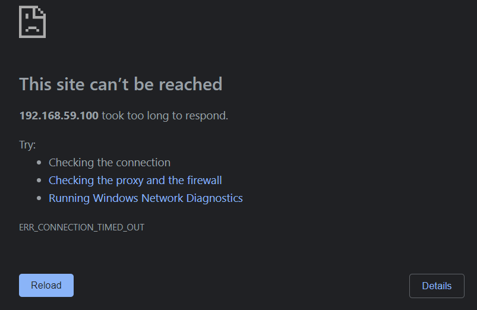

# Lab 4: Container orchestration with Kubernetes

## 4.1. Set up the lab environment

Minikube en kubectl installeren verliep vlot, hier was er geen enkel probleem mee.
Ook het opstarten, na wat geduld te hebben, ging goed en het dashboard opende ook zoals gehoopt.
Ik heb besloten om de extra nodes niet toe te voegen, omdat ik dacht dat het labo op zichzelf al voldoende werk zal vragen.

## 4.2. Basic operation

### 4.2.1. Hello world!

De instructies op de kubernetes-website waren zeer duidelijk, maar toen ik de app opende met `minikube service hello-node` kreeg ik geen verbinding met de container. 

De error had te maken met een fout in een commando op de website, dacht ik. Ik heb dan de service en deployment verwijderd, en met een aangepast commando opnieuw geprobeerd. Nu keek ik in het dashboard, en zag ik dat de deployment groen was, dus dacht ik dat dit wel ging werken. Maar helaas, ik kreeg nu een gelijkaardige error, maar als message stond er `ERR_CONNECTION_REFUSED`

Na wat zoeken heb ik het gevraagd aan een klasgenoot, en omdat het bij hem ook niet werkte (en het uiteindelijk toch een tutorial is voor de rest van het labo) heb ik tactisch besloten om het links te laten liggen.

### 4.2.2. Working with manifest files

## 4.3. Labels and selectors

### 4.3.1. Manipulating labels manually

### 4.3.2. Setting labels in the manifest file

## 4.4. Deploy a multi-tier web application

## 4.5. Clean up

